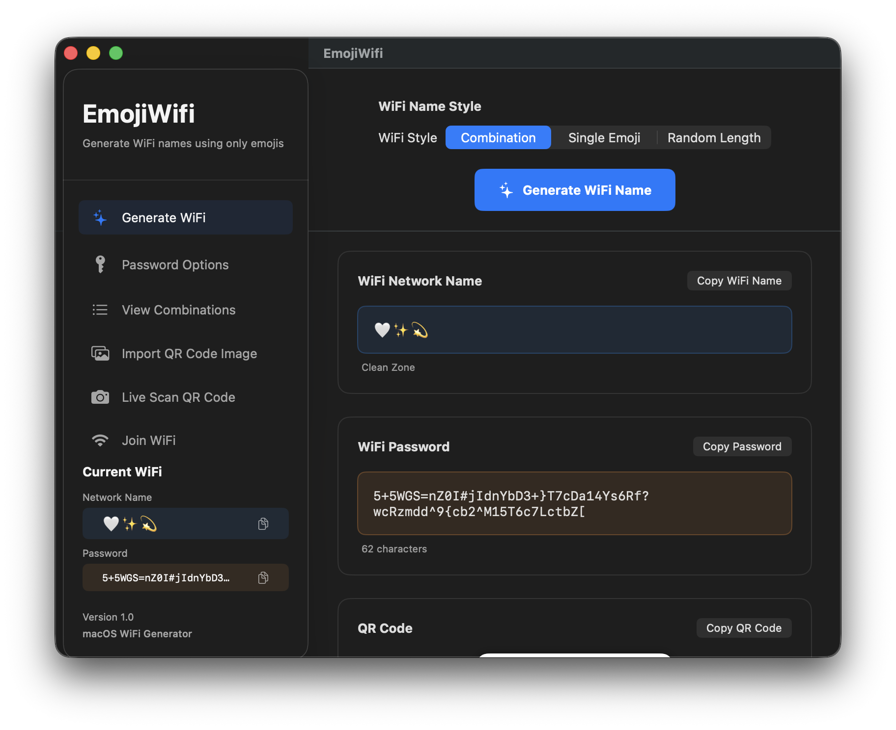
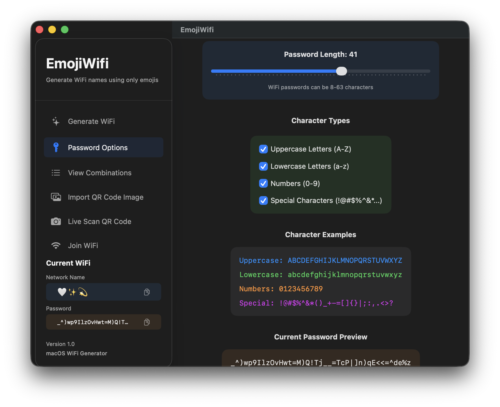
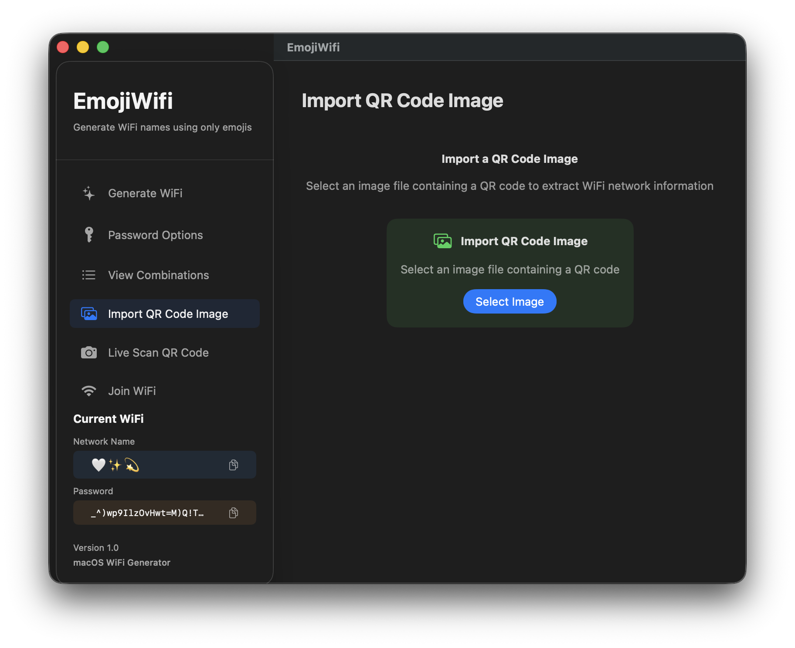
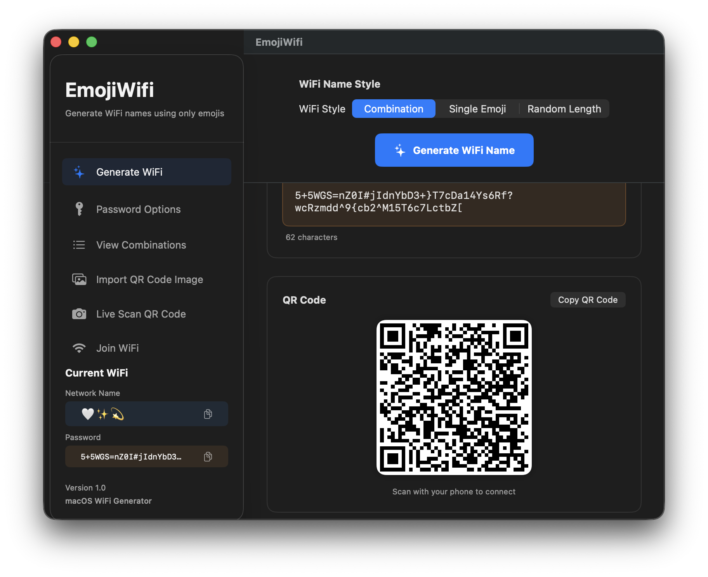
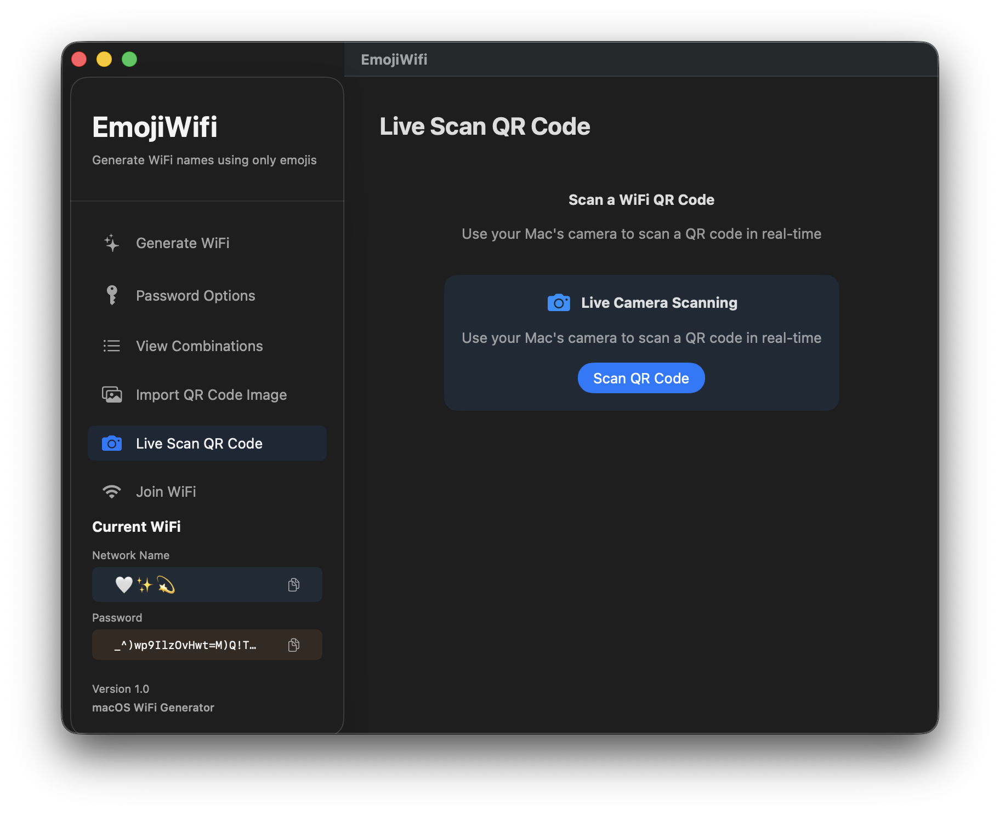
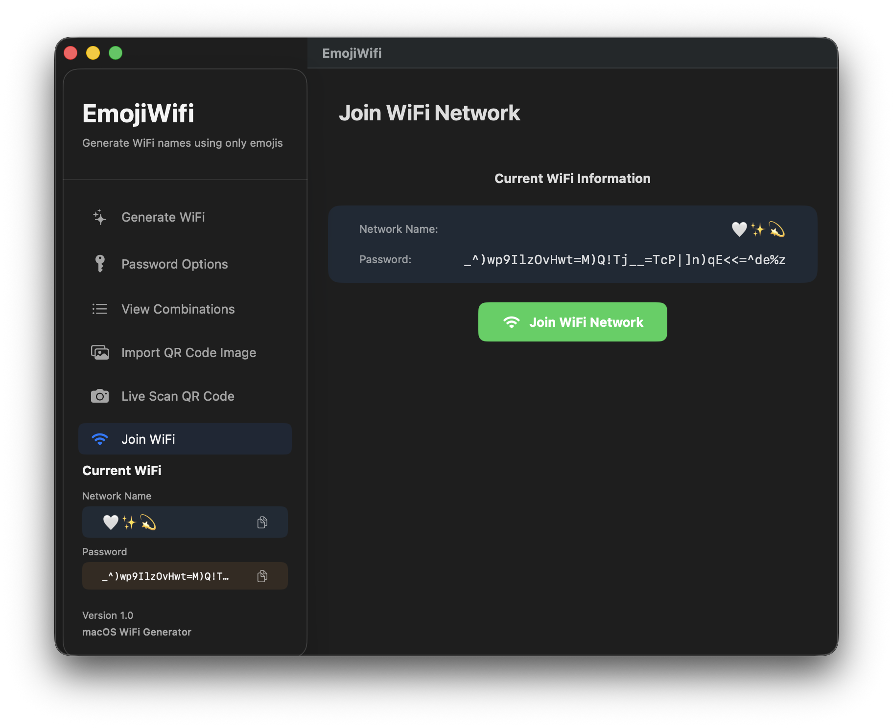

# EmojiWifi

A simple and elegant macOS app that generates WiFi network names using only emojis! 🚀📶✨

## 📥 Download it now
[**Download EmojiWifi for macOS**](https://github.com/dparksports/emoji-wifi-mac-public/releases/download/v1.4/EmojiWifi_Notarized.zip)
*(Requires macOS 13.0 or later)*

## Features

- **Generate emoji-only WiFi names** - No text, just pure emoji combinations
- **Multiple generation styles**:
  - **Combination**: Curated themed emoji combinations (e.g., "🚀🛰️🌌" for Space Station)
  - **Single Emoji**: Ultra-minimal single emoji names (e.g., "📶")
  - **Random Length**: Random combinations of 1-4 emojis
- **Beautiful modern UI** with smooth animations
- **Copy to clipboard** functionality
- **Browse all combinations** with search functionality
- **QR Code Support**:
  - Generate QR codes for your networks
  - Import QR codes from images
  - Live scan QR codes using your camera
- **Auto-Join**: Connect to networks directly from the app

## How to Use

### 1. Generate WiFi
Create unique, secure, and fun WiFi credentials.
- **Select Style**: Choose between "Combination", "Single Emoji", or "Random Length".
- **Generate**: Click the "Generate WiFi Name" button.
- **Results**: The app displays the generated Name, Password, and a QR Code.
- **Copy**: Click the copy icons to copy the name or password to your clipboard.

### 2. Password Options
Customize the security of your generated passwords.
- **Length**: Adjust the password length (8-63 characters).
- **Complexity**: Toggle Uppercase, Lowercase, Numbers, and Special Characters.
- **Preview**: See a live preview of the password format.

### 3. View Combinations
Browse the library of curated emoji WiFi names.
- **Search**: Type to find specific themes (e.g., "Space", "Food").
- **Copy**: Click any card to copy the emoji string to your clipboard.

### 4. Import QR Code Image
Extract WiFi credentials from a saved QR code image.
- **Select Image**: Click to browse your files for a QR code image.
- **Process**: The app extracts the SSID and Password.
- **Use**: Click "Use This WiFi" to load it into the main generator or join it.

### 5. Easy Sharing
Share your WiFi credentials instantly, even with complex passwords.
- **QR Code**: The app generates a clear QR code for your network.
- **Scan to Join**: Guests can simply scan the code with their phone camera to join immediately—no typing required!
- **Secure**: Perfect for sharing long, secure passwords without the hassle.

### 6. Live Scan QR Code
Scan a WiFi QR code using your Mac's camera.
- **Scan**: Click "Scan QR Code" to open the camera view.
- **Detect**: Hold a QR code in front of the camera.
- **Result**: The app automatically detects and parses the WiFi credentials.

### 7. Join WiFi
Connect to a network directly.
- **Status**: Shows the currently loaded Network Name and Password.
- **Join**: Click "Join WiFi Network" to attempt a connection using the system network interface.

## License

This project is open source and available under the [GNU General Public License v3.0](LICENSE).
